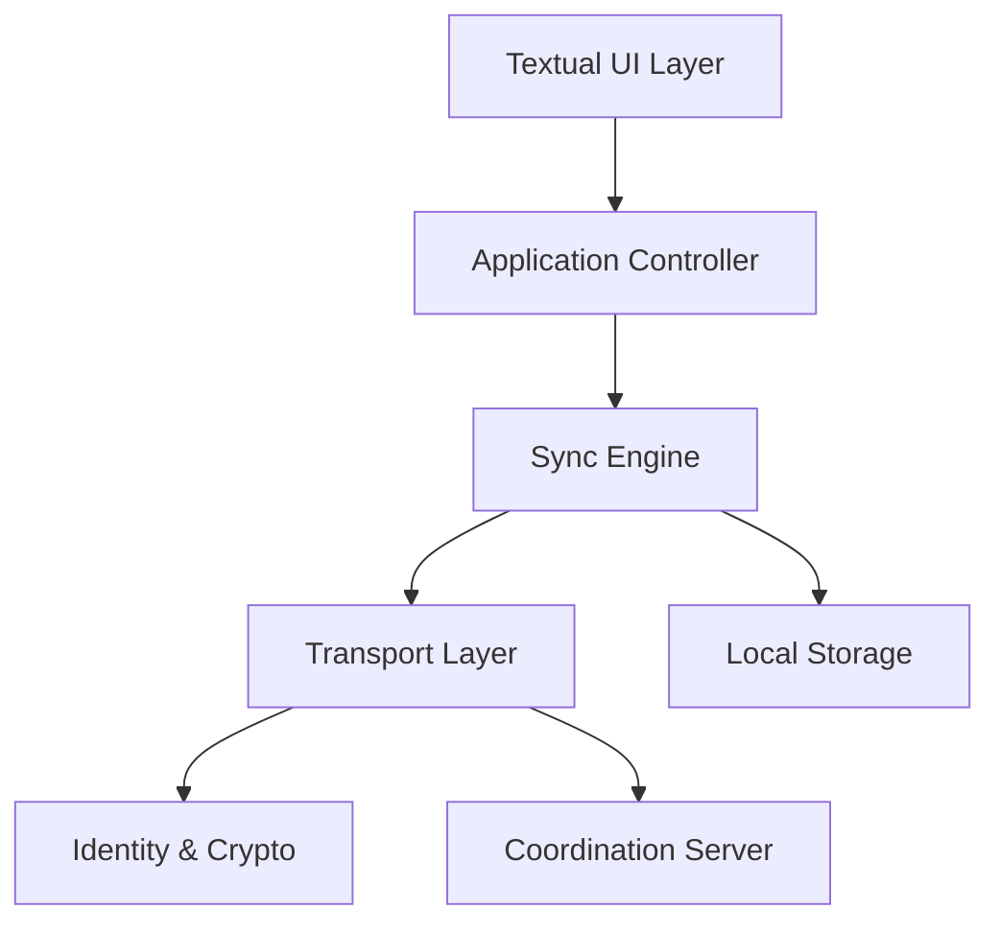
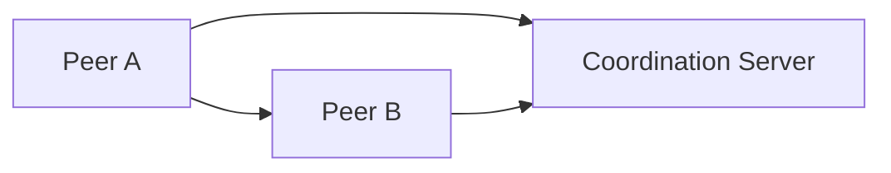
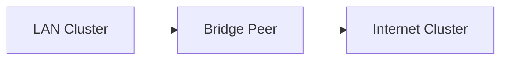
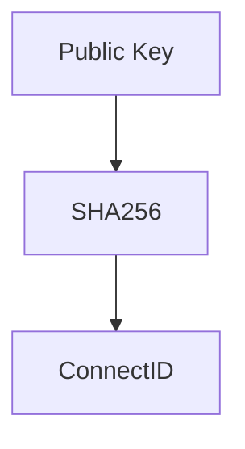
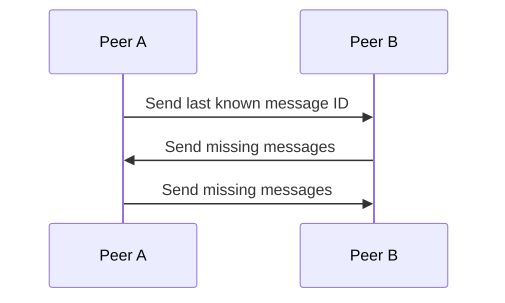

# Nexus

Nexus is a hybrid offline-first distributed communication system designed to operate across local networks and the public internet with minimal centralized dependency.

The system is built around permanent cryptographic identity, adaptive transport selection, and local-first data ownership. Nexus is not purely centralized and not purely peer-to-peer; it implements a layered hybrid architecture that adapts to network availability.

---

## 1. Design Objectives

Nexus is built with the following goals:

* Operate fully on LAN without internet
* Operate across the internet with optional coordination
* Maintain permanent cryptographic identity
* Preserve local device as primary data authority
* Support adaptive transport (LAN, direct P2P, relay)
* Enable high-speed local file transfer
* Provide structured foundation for voice and video signaling

---

## 2. System Architecture

Nexus is structured into layered components to maintain strict separation of concerns.

### Layer Descriptions

**UI Layer**

* Built with Textual
* Responsible only for presentation and user interaction
* No networking logic

**Controller Layer**

* Application orchestration
* Routes UI commands to core engine

**Sync Engine**

* Message reconciliation
* Eventual consistency logic
* Conflict handling

**Transport Layer**

* LAN discovery
* Direct TCP connections
* Internet coordination
* Relay fallback

**Identity & Crypto Layer**

* Permanent ConnectID generation
* Keypair management
* Message signing and encryption

**Local Storage**

* SQLite-backed
* Append-only message log
* Contact and peer state

**Coordination Server**

* Peer registry
* Endpoint lookup
* Relay assistance
* Does not store plaintext messages

---

## 3. Network Modes

Nexus operates in three adaptive modes.

### 3.1 LAN Mode

* UDP peer discovery
* Direct encrypted TCP communication
* No internet required
* Full-speed file transfer

---

### 3.2 Internet Mode

* Client registers endpoint with coordination server
* Peer lookup by ConnectID
* Direct connection attempt
* Relay fallback if NAT traversal fails

The server facilitates discovery but does not control identity or store message history.

---

### 3.3 Mixed Mode (Bridged Clusters)

If one peer has both LAN and internet access, it can synchronize state between clusters.

This enables eventual consistency across distributed network segments.

---

## 4. Identity Model

Each user is assigned a permanent cryptographic identity.

* Public/private keypair generated locally
* ConnectID derived from public key
* Immutable once created
* Email-backed registration for recovery
* Server does not generate identity

Identity structure:

Messages are signed and encrypted using the identity layer.

---

## 5. Data Model

Nexus follows a local-first architecture.

* Messages stored locally
* Peers exchange missing entries during sync
* Append-only message log
* Deterministic reconciliation

Sync flow:

This ensures eventual consistency without centralized message authority.

---

## 7. Technology Stack

Core:

* Python 3.11+
* Textual
* AsyncIO
* SQLite
* NaCl (cryptography)

Networking:

* UDP (LAN discovery)
* TCP (direct transport)
* WebSocket (coordination)
* WebRTC (planned for media)

Server:

* FastAPI
* PostgreSQL
* TURN (for media relay)

---

## 8. Project Status

Active early-stage development.
Current focus: Stage 0 – UI foundation.

---

